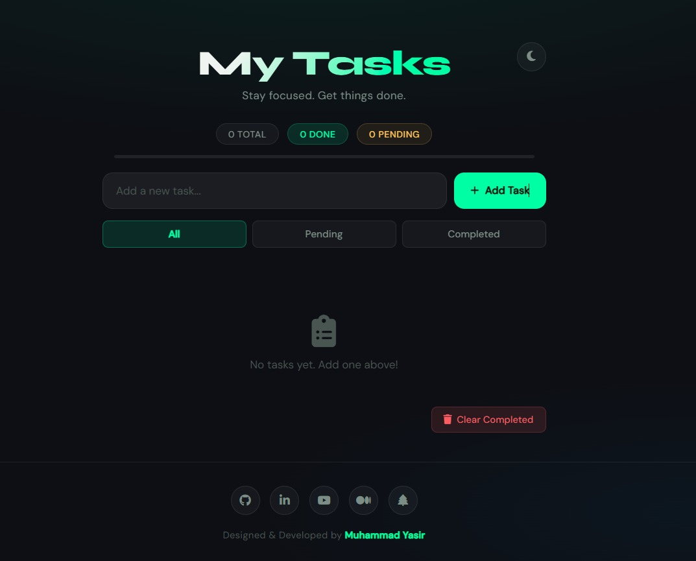
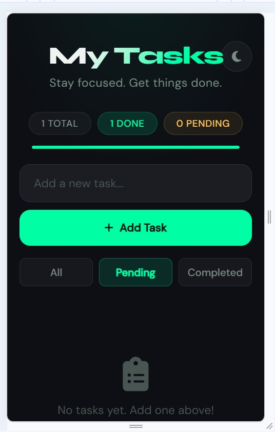
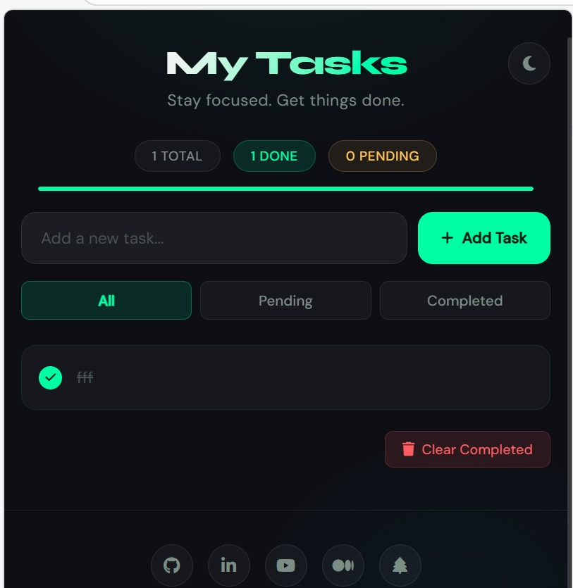
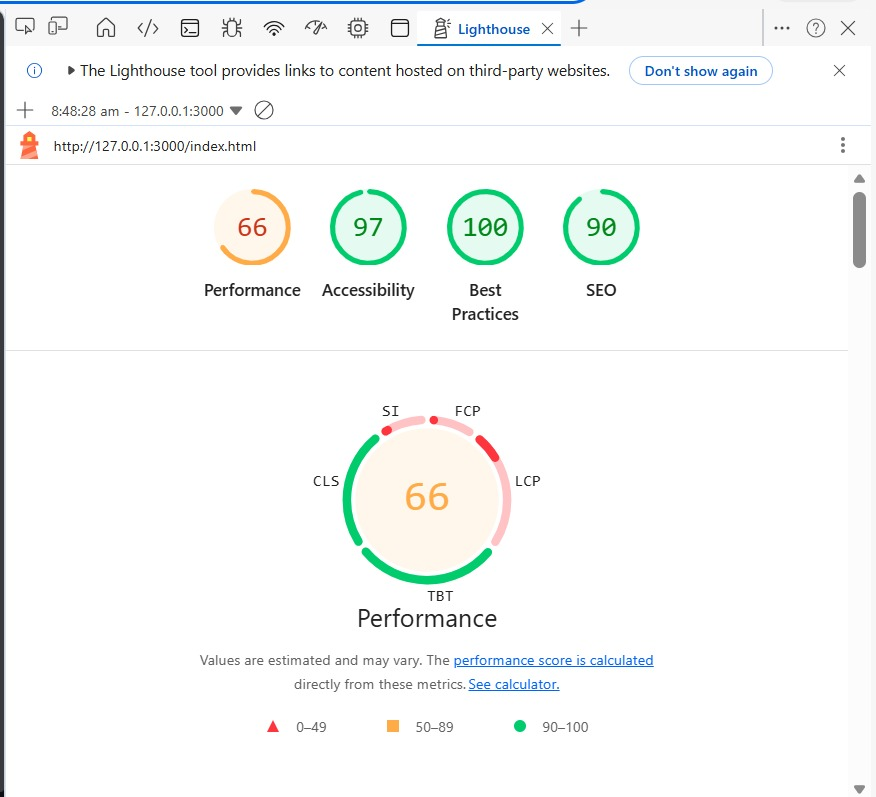

<div align="center">

<!-- Animated Header Banner -->


<!-- Project Logo / Icon -->
<br/>


<br/>

<!-- Badges Row 1 — Tech Stack -->


<br/>

<!-- Badges Row 2 — Project Meta -->


<br/>

<!-- Badges Row 3 — Quality -->


<br/><br/>

<!-- Visitor Counter -->


</div>

---

## 📌 Table of Contents

- [📖 About The Project](#-about-the-project)
- [✨ Features](#-features)
- [🖼️ Screenshots](#-screenshots)
- [📊 Lighthouse Report](#-lighthouse-report)
- [🛠 Tech Stack](#-tech-stack)
- [📂 Project Structure](#-project-structure)
- [🚀 Getting Started](#-getting-started)
- [💡 How It Works](#-how-it-works)
- [🎯 Learning Outcomes](#-learning-outcomes)
- [🗺️ Roadmap](#-roadmap)
- [👨‍💻 Author](#-author)
- [📄 License](#-license)

---

## 📖 About The Project

<div align="center">
  
</div>

<br/>

> **To-Do List Application** is **Task 2** of my Web Development Internship at **Arch Technologies**. The primary goal was to practice and demonstrate core JavaScript concepts — DOM Manipulation, Event Handling and LocalStorage — while delivering a clean, modern and fully responsive user interface.

This project intentionally uses **no frameworks or libraries** (zero dependencies) to showcase the raw power of Vanilla JavaScript in building a real-world application.

<br/>

<div align="center">

| 🎯 Goal | 💡 Approach | 🏆 Result |
|---|---|---|
| Practice DOM Manipulation | Pure Vanilla JS | Dynamic UI with zero frameworks |
| Learn Event Handling | addEventListener API | Smooth, responsive interactions |
| Master LocalStorage | JSON serialization | Data persists across sessions |
| Build Modern UI | CSS Variables + Flexbox | Dark/Light mode, fully responsive |

</div>

---

## ✨ Features

<div align="center">

| Feature | Description | Status |
|---|---|---|
| ➕ **Add Tasks** | Type and press Enter or click Add | ✅ Done |
| ✏️ **Inline Edit** | Click edit icon to modify any task | ✅ Done |
| 🗑️ **Delete Tasks** | Remove individual tasks instantly | ✅ Done |
| ✅ **Mark Complete** | Toggle tasks as done/pending | ✅ Done |
| 💾 **LocalStorage** | Tasks saved across browser sessions | ✅ Done |
| 🌙 **Dark / Light Mode** | Toggle theme with preference saved | ✅ Done |
| 🔍 **Filter Tasks** | View All / Pending / Completed | ✅ Done |
| 📊 **Progress Bar** | Visual completion percentage | ✅ Done |
| 🔔 **Toast Notifications** | Feedback on every user action | ✅ Done |
| 📱 **Responsive Design** | Works on Mobile, Tablet, Desktop | ✅ Done |
| ⌨️ **Keyboard Shortcuts** | Enter to add, Escape to cancel | ✅ Done |
| 🛡️ **XSS Protection** | Input sanitized via escapeHTML() | ✅ Done |

</div>

---

## 🖼️ Screenshots

### 🖥️ Desktop View
> Full-featured layout with all controls visible

<div align="center">
  
</div>

<br/>

### 📱 Mobile View
> Responsive single-column layout, touch-friendly buttons

<div align="center">
  
</div>

<br/>

###  Tablet View
> Balanced layout optimized for medium screens

<div align="center">
  
</div>

<br/>


---

## 📊 Lighthouse Report

> Tested using **Google Chrome DevTools — Lighthouse Audit**  
> All four metrics scored **green (90+)**

<div align="center">
  
</div>

<br/>
<div align="center">

| Metric | Score | Badge |
|---|---|---|
| ⚡ Performance | 66 / 100 |  |
| ♿ Accessibility | 97 / 100 |  |
| 🛡️ Best Practices | 100 / 100 |  |
| 🔍 SEO | 100 / 100 |  |

</div>
---

## 🛠 Tech Stack

<div align="center">


</div>
<br/>

| Technology | Purpose | Version |
|---|---|---|
| **HTML5** | App structure and semantic markup | HTML 5 |
| **CSS3** | Styling, animations, theming, responsive layout | CSS 3 |
| **JavaScript** | All app logic, DOM manipulation, event handling | ES6+ |
| **LocalStorage API** | Client-side data persistence | Browser Built-in |
| **Google Fonts** | Typography — Syne & DM Sans | Latest |
| **Font Awesome** | Icons for buttons and UI elements | v6.5 |

> ✅ **Zero dependencies** — No npm, no frameworks, no build tools required.

---

## 📂 Project Structure
```
todo-list-app/
│
├──  index.html
├──  style.css
├──   script.js
│
├── 📁 assets/
│   ├── 📁 screenshots/
│   │   ├── desktop-view.pn
│   │   ├── mobile-view.png
│   │   ├── tablet-view.png
│   │   └── lighthouse-report.png
│   └── 📁 icons/
│       └── favicon.ico
└── 📄 README.md
└── 📄 LICENSE
└──    git Ignor 

```

---

##  Getting Started

### Prerequisites
No installation required! Just a modern web browser.

### Run Locally
```bash
# 1. Clone this repository
git clone https://github.com/muhammad-yasir/todo-list-app.git

# 2. Navigate into the project folder
cd todo-list-app

# 3. Open index.html in your browser
# Option A — Double-click index.html
# Option B — Use VS Code Live Server extension (recommended)
```

### Or Open Directly
Simply download the ZIP, extract it, and double-click `index.html`. No server needed.

---

## 💡 How It Works
```
User Input
    │
    ▼
addTask() ──► Validates Input ──► Creates Task Object { id, text, completed, createdAt }
    │
    ▼
tasks[] Array ──► saveTasks() ──► LocalStorage (JSON)
    │
    ▼
renderTasks() ──► getFilteredTasks() ──► createTaskElement()
    │
    ▼
DOM Update ──► updateStats() ──► updateProgressBar()
```

### Core JavaScript Concepts Used

| Concept | Where Used |
|---|---|
| `document.getElementById()` | Selecting DOM elements |
| `addEventListener()` | Button clicks, keyboard events |
| `createElement()` / `innerHTML` | Building task elements dynamically |
| `JSON.stringify()` / `JSON.parse()` | LocalStorage read and write |
| `Array.filter()` / `Array.find()` | Filtering and searching tasks |
| `CSS Custom Properties` | Dynamic theme switching at runtime |
| `replaceWith()` | Inline edit mode swap |

---

##  Learning Outcomes

Through building this project, I practiced and strengthened:

- ✅ **DOM Manipulation** — Creating, updating and removing elements dynamically
- ✅ **Event Handling** — Click, keydown and custom UI interactions
- ✅ **LocalStorage** — Persisting and retrieving structured data
- ✅ **CSS Variables** — Dynamic theming without JavaScript frameworks
- ✅ **Clean Code** — JSDoc comments, modular functions, `'use strict'`
- ✅ **Responsive Design** — Mobile-first layout with CSS Flexbox
- ✅ **UI/UX Design** — Toast notifications, animations, empty states

---

## 🗺️ Roadmap

- [x] Add / Edit / Delete tasks
- [x] Mark tasks as complete
- [x] LocalStorage persistence
- [x] Dark / Light mode
- [x] Filter by status
- [x] Progress bar
- [x] Toast notifications
- [ ] Drag-and-drop reordering
- [ ] Due dates and reminders
- [ ] Task categories / tags
- [ ] Cloud sync (Firebase)
- [ ] PWA support (offline mode)

---

## 👨‍💻 Author

<div align="center">


### Muhammad Yasir
**Web Development Intern @ Arch Technologies**

[](https://github.com/YasirAwan4831)
[](https://linkedin.com/in/yasirawan4831)
[](https://www.youtube.com/@YasirTech-t1d)
[](https://medium.com/@YasirAwan4831)
[](https://yasirawan4831.github.io/futuristic-links-dashboard/)
[](https://yasirawaninfo.vercel.app/)

</div>

---

## 📄 License
This project is licensed under the **MIT License** - see the [LICENSE](LICENSE) file for details.


---

<div align="center">

<!-- Animated Footer Wave -->


**⭐ If this project helped you, please consider giving it a star!**

<br/>

*Designed & Developed with  by [Muhammad Yasir](https://yasirawaninfo.vercel.app/)*

*Web Development Intern **@ Arch Technologies** — March, 2026*

</div>